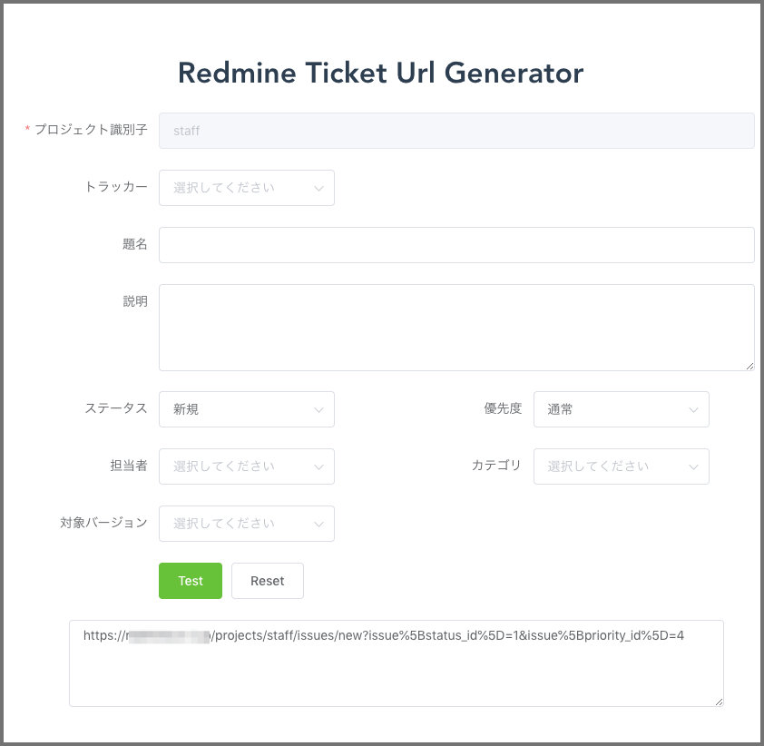
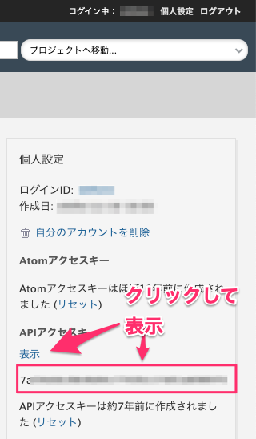

# redmine-ticket-url-generator

[Redmineワンポイントチェック(2): URLに入力値を埋め込んでチケット作成のテンプレートを実現する | Redmine.JP Blog](http://blog.redmine.jp/articles/opc/new-issue-template/)





## Requirement

* [Docker](https://www.docker.com/products/docker-desktop)
* [Make for Windows](http://gnuwin32.sourceforge.net/packages/make.htm) Windows な場合


## Install

1. clone
2. `.env.sample` を `.env` にコピー
3. ホストを設定  
`.env` の `VUE_APP_REDMINE_HOST` をチケットを作成する Redmine のホストに変更
4. API アクセスキーの取得  

5. API アクセスキーを設定  
`.env` の `VUE_APP_REDMINE_API_ACCESS_KEY` に取得した API アクセスキーを設定する

## Usage

1. コンテナ立ち上げ

```
$ make up
```

2. ブラウザでアクセス

http://localhost:8088/

ポートが被る場合は、docker-compose.yml を修正。

3. 終了

```
$ make down
```

## Development

```
$ git clone git@github.com:oppara/redmine-ticket-url-generator.git
$ cd /path/to/repo
$ npm install
$ make up
$ make serve
```

## Misc

* [Vue.js](https://vuejs.org/)
* [Element - A Desktop UI Toolkit for Web](https://element.eleme.io/#/en-US)
* [axios/axios: Promise based HTTP client for the browser and node.js](https://github.com/axios/axios)
* [TypeScript - JavaScript that scales.](https://www.typescriptlang.org/)
* [Jest · 🃏快適なJavaScriptのテスト](https://jestjs.io/ja/)

* [Rest api - Redmine](http://www.redmine.org/projects/redmine/wiki/Rest_api)

* Vue.js 用のサーバとは別にCORS 対応が面倒なので、Proxy サーバ立てます。 [CORS-Proxy](https://github.com/oppara/CORS-Proxy)  
ポートが被る場合は、docker-compose.yml を修正。

